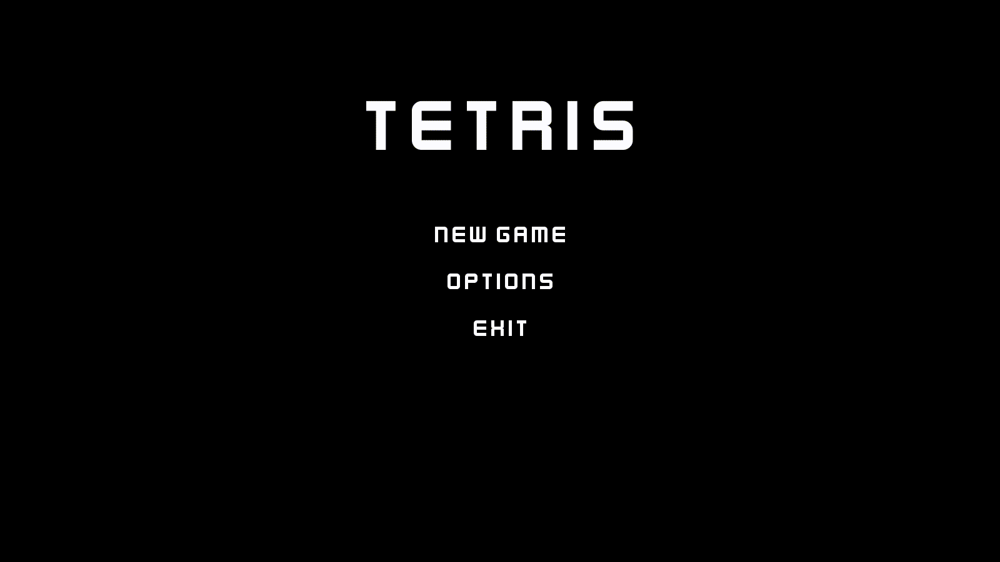
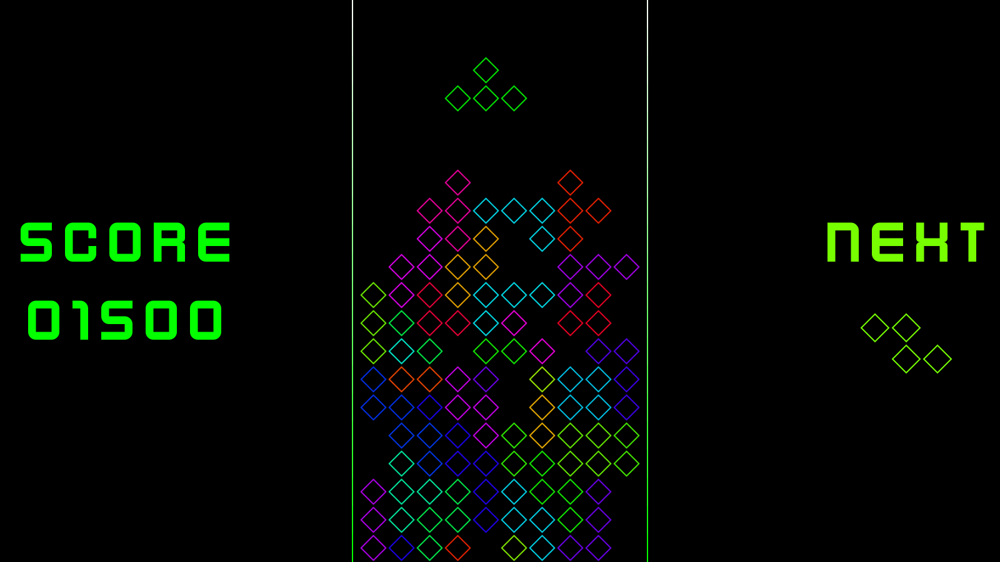

# Tetris
Реализация Тетриса на Unity (C#).

## Описание
В игре присутствует два режима:

### Basic
Представляет из себя классический Тетрис.

### Advanced
- вводятся дополнительные тетрамино
- меняются вероятности выпадения деталей
- размер поля увеличен на 2 клетки в ширину
- линии уничтожаются только при заполнении двух линий подряд
- при достижении правой или левой границы фигуры проходят с противоположной стороны

## Управление:
* W - повернуть деталь по часовой стрелке
* A - переместить деталь на клетку влево
* D - переместить деталь на клетку вправо
* S - ускорить падение детал
* Escape - пауза

